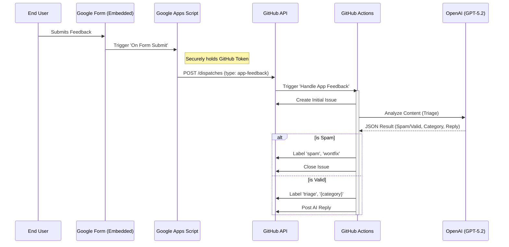

# GitHub Integration & Feedback Setup

This document outlines the **AI-Powered Feedback Triage** system for TechnologyOne Analyser. This system uses **Google Forms** as the user interface, **Google Apps Script** as the bridge, and **GitHub Actions** for AI-driven processing.

## 1. System Architecture

The feedback system uses an **Event-Driven Architecture** that securely bridges a public form to your private repository.

### Data Flow Diagram



## 2. The Implementation

### A. The Interface: Google Form
The application embeds a Google Form (via iframe). This handles:
*   UI rendering
*   Spam prevention (Google's native checks)
*   Anonymous users (no GitHub account required)

### B. The Bridge: Google Apps Script
A bespoke script linked to the Form's "Response" sheet acts as the secure backend proxy.

**Script Logic:**
```javascript
function onFormSubmit(e) {
  var feedback = e.values[1]; // Column B: Feedback
  var reporter = e.values[2]; // Column C: Contact/Name (Optional)
  
  var payload = {
    "event_type": "app-feedback",
    "client_payload": {
      "reporter": reporter || "Anonymous",
      "feedback": feedback
    }
  };

  var options = {
    "method": "post",
    "headers": {
      "Authorization": "token " + PropertiesService.getScriptProperties().getProperty('GITHUB_PAT'),
      "Accept": "application/vnd.github.v3+json"
    },
    "contentType": "application/json",
    "payload": JSON.stringify(payload)
  };

  UrlFetchApp.fetch("https://api.github.com/repos/:owner/:repo/dispatches", options);
}
```

### C. The Brain: GitHub Workflow
The core logic resides in `.github/workflows/handle-feedback.yml`.

1.  **Trigger**: The workflow is triggered via the `repository_dispatch` event from the Google Script.
2.  **Issue Creation**: Immediately creates a new GitHub Issue from the payload.
3.  **AI Triage (GPT-5.2)**:
    *   The content is sent to OpenAI's `gpt-5.2` model.
    *   **Structured Output Response**:
        *   `classification`: `SPAM` or `VALID`
        *   `category`: `bug`, `feature`, or `ux`
        *   `reply`: A technical, markdown-formatted response.
4.  **Automated Action**:
    *   **If SPAM**: Issue labeled `spam`, `wontfix` and **Closed**.
    *   **If VALID**: Issue labeled `triage`, `{category}`. A comment is posted with the AI's analysis.

## 3. Configuration Breakdown

### Workflow File: `handle-feedback.yml`
*   **Permissions**: Grants `issues: write` to allow the bot to create/modify issues.
*   **Secrets**:
    *   `OPENAI_API_KEY`: Required for the AI triage step.
    *   `GITHUB_TOKEN`: Standard token used to interact with the repository.

### App Config
*   **Google Form**: Must be public or accessible to target users.
*   **Apps Script**:
    *   Trigger: `On Form Submit`
    *   Property: `GITHUB_PAT` (Personal Access Token with `repo` scope).

## 4. Why this approach?
1.  **Security**: The GitHub PAT is stored in Google Apps Script properties, never exposed to the client browser.
2.  **Accessibility**: Users do not need a GitHub account to submit bugs.
3.  **Automation**: Issues are created and triaged automatically without human intervention for spam or categorization.
